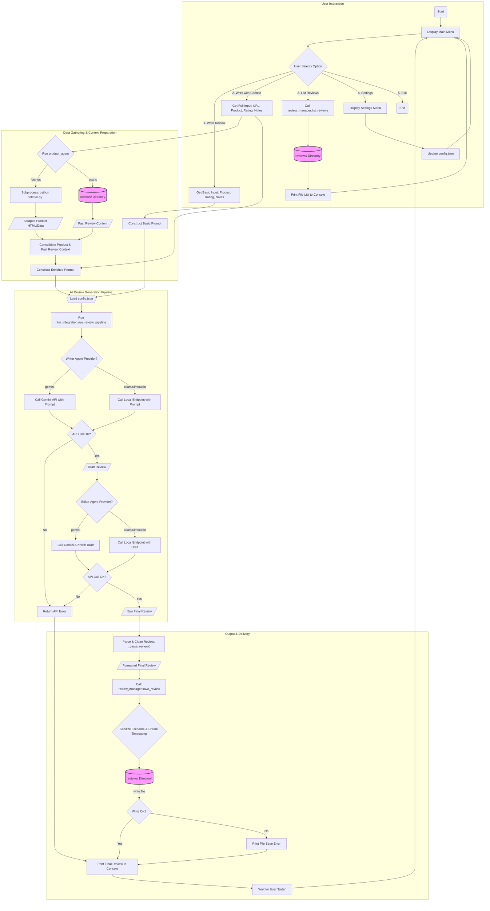

```mermaid
graph TD
    subgraph User Interaction
        A(Start) --> B[Display Main Menu];
        B --> C{User Selects Option};
        C -- "1. Write Review" --> D[Get Basic Input: Product, Rating, Notes];
        C -- "2. Write with Context" --> E[Get Full Input: URL, Product, Rating, Notes];
        C -- "3. List Reviews" --> F[Call review_manager.list_reviews];
        F --> G[(reviews/ Directory)];
        G --> H[Print File List to Console];
        H --> B;
        C -- "4. Settings" --> I[Display Settings Menu];
        I --> J[Update config.json];
        J --> B;
        C -- "5. Exit" --> K(End);
    end

    subgraph "Data Gathering & Context Preparation"
        D --> L[Construct Basic Prompt];
        E --> M{Run product_agent};
        M -- "fetches" --> N[Subprocess: python fetcher.py <URL>];
        N --> O[/Scraped Product HTML/Data/];
        M -- "scans" --> P[(reviews/ Directory)];
        P --> Q[/Past Review Content/];
        O & Q --> R["Consolidate Product & Past Review Context"];
        R & E --> S[Construct Enriched Prompt];
    end

    subgraph "AI Review Generation Pipeline"
        L & S --> T{{Load config.json}};
        T --> U[Run llm_integration.run_review_pipeline];
        
        U --> V{Writer Agent Provider?};
        V -- "gemini" --> W_Cloud[Call Gemini API with Prompt];
        V -- "ollama/lmstudio" --> W_Local[Call Local Endpoint with Prompt];
        
        W_Cloud --> X{API Call OK?};
        W_Local --> X;

        X -- "No" --> Y[Return API Error];
        X -- "Yes" --> Z[/Draft Review/];

        Z --> AA{Editor Agent Provider?};
        AA -- "gemini" --> BB_Cloud[Call Gemini API with Draft];
        AA -- "ollama/lmstudio" --> BB_Local[Call Local Endpoint with Draft];

        BB_Cloud --> CC{API Call OK?};
        BB_Local --> CC;
        
        CC -- "No" --> Y;
        CC -- "Yes" --> DD[/Raw Final Review/];
    end

    subgraph "Output & Delivery"
        DD --> EE["Parse & Clean Review: _parse_review()"];
        EE --> FF[/Formatted Final Review/];
        FF --> GG[Call review_manager.save_review];
        GG --> HH{Sanitize Filename & Create Timestamp};
        HH --> II[(reviews/ Directory)];
        II -- "write file" --> JJ{Write OK?};
        JJ -- "Yes" --> KK[Print Final Review to Console];
        JJ -- "No" --> LL[Print File Save Error];
        Y --> KK;
        LL --> KK;
        KK --> MM[Wait for User 'Enter'];
        MM --> B;
    end

    style G fill:#f9f,stroke:#333,stroke-width:2px
    style P fill:#f9f,stroke:#333,stroke-width:2px
    style II fill:#f9f,stroke:#333,stroke-width:2px
```
